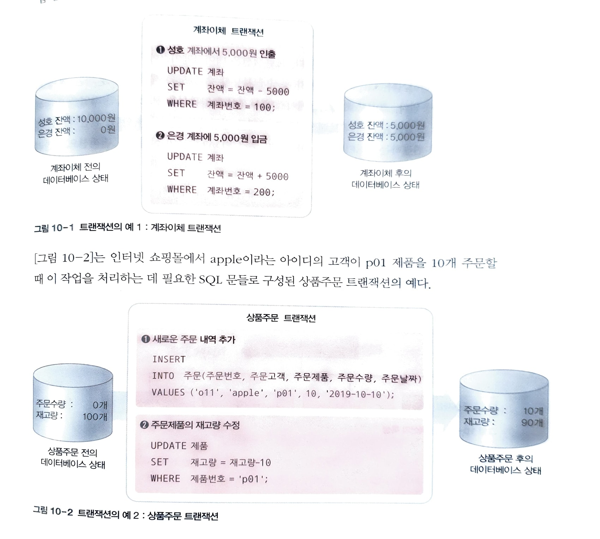
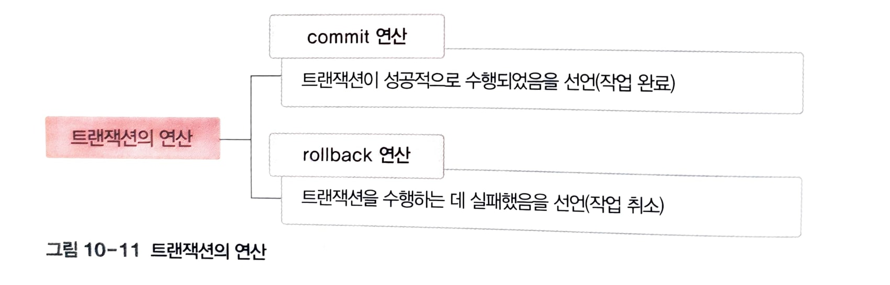

# 트랜잭션

- 데이터베이스에서 하나의 작업을 수행하는데 필요한 연산을 모아놓은 것
- 데이터베이스에서 논리적인 작업의 단위
- 작업 수행에 필요한 SQL문의 모임으로 이해할 수 있음

위의 예시 처럼 계좌이체를 한다면 보내는 사람의 계좌에서 돈을 빼고 받는 사람의 계좌에 돈을 넣는 것 까지 이루어져야 전체 트랜잭션이 성공하는 것이다.

## 트랜잭션의 특성

### 1. 원자성 (Atomicity)

- 트랜잭션을 구성하는 연산들이 모두 정상적으로 실행되거나 하나도 실행되지 않아야 함
- all-or-nothing
- 계좌이체의 예시처럼 트랜잭션 내의 일부 연산만 실행되는 것은 안된다
- 만약 중간에 장애가 발생하면 트랜잭션 수행 이전 상태로 복구되어야 한다

### 2. 일관성 (Consistency)

- 트랜잭션이 성공적으로 수행된 후에도 데이터베이스가 일관된 상태를 유지해야 함
    - 역시 계좌이체 예시에서 성호와 은경의 잔액은 각각 10000원, 0원이다
    - 트랜잭션 후에는 각각 5천원 씩 가지게 됨
    - 트랜잭션 이전과 상태가 달라졌지만 계좌 잔액의 합계는 10000원으로 동일
        
        —> 일관성을 유지
        
    - 트랜잭션 후에 모순된 데이터가 존재하면 안된다

### 3. 격리성 (Isolation)

- 현재 수행중인 트랜잭션이 완료될 때까지 생기는 중간 결과에 대해 다른 트랜잭션이 접근할 수 없음
- 위의 계좌이체에서,
    - 성호의 5천원을 뺀 후 아직 은경의 계좌에 5천원을 추가하지 않았는데
    - 추가적으로 은경의 계좌에 천원을 입금하는 연산이 추가된다면?
    - 성호 5천 - 은경 1천 / 성호 5천 - 은경 5천 이렇게 두 가지 결과가 생길 수 있게 된다
        
        —> 데이터베이스의 모순된 데이터 있으면 안됨
        
- 사용자들은 트랜잭션들이 동시에 수행되는 것처럼 느끼면서도 정확하고 일관된 결과를 얻을 수 있다

### 4. 지속성 (Durability)

- 트랜잭션이 성공적으로 완료된 후 데이터베이스에 결과가 반영되면, 손실되지 않고 영구적이어야 한다
- 시스템 장애가 생기더라도 트랜잭션 결과는 사라지지 않고 남아있어야 한다
    
    —> 원래 상태로 복구하는 회복 기능이 필요
    

## 트랜잭션의 연산

- commit은 작업이 완료되었음을 선언
    - 트랜잭션을 구성하는 모든 연산이 끝나면 commit을 통해 해당 트랜잭션이 끝났고, 데이터베이스에 그 결과를 반영시킨다
- rollback은 트랜잭션 수행이 실패하여 이전 상태로 되돌리는 것
    - 트랜잭션 수행 중 일부 연산이 실패하면 트랜잭션 수행 이전 상태로 데이터베이스를 복구한다