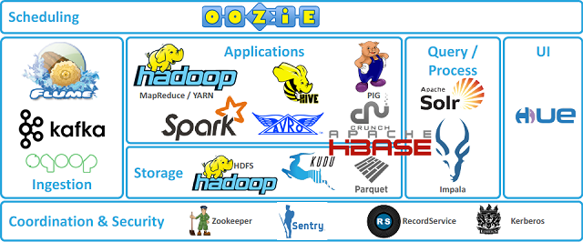
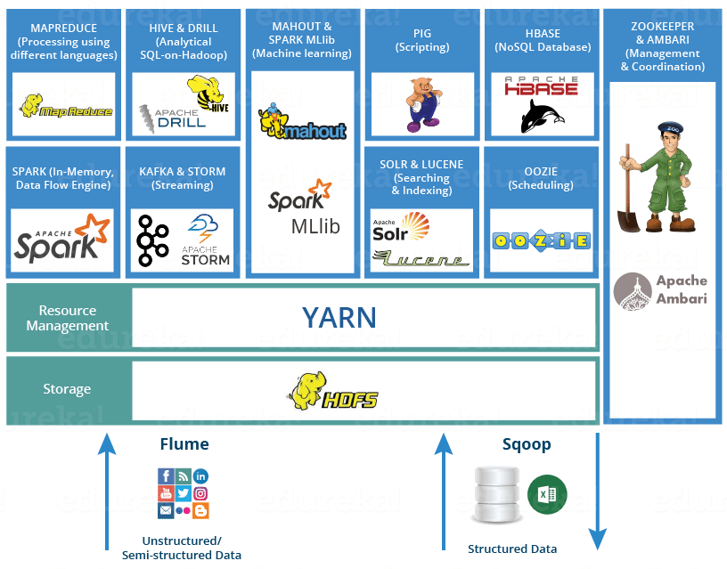
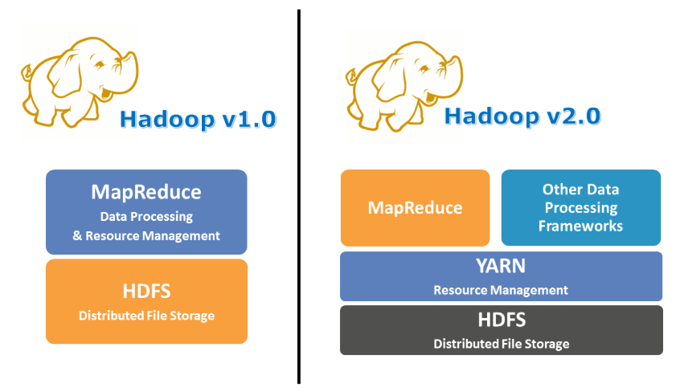

# Hadoop이란?

하둡은 여러대의 컴퓨터 클러스터에서 대규모 데이터를 분산처리할 수 있게 해주는 프레임워크이다. 

하둡 분산처리 시스템 (HDFS)과 MapReduce 프레임워크로 시작했으나 여러 데이터 저장, 실행 엔진, 처리 등 다양한 하둡 생태계 전반을 포함하는 의미로 발전하고있다.

- 하둡의 코어 프로젝트 : HDFS, MapReduce
- 그 외의 프로젝트들은 서브 프로젝트로 워크플로우 관리, 데이터 마이닝 분석, 수직 등을 수행한다.

**우선 하둡 생태계에 어떤 프로젝트들이 있는지 간단하게 알아보고 추후에 하나씩 자세히 알아볼 것이다.**

### HDFS

하둡 네트워크에 연결된 기기에 데이터를 저장하는 분산형 파일 시스템. 여러 저장소에 대용량 파일을 나워서 저장한다. 그리고 여러 서버에 중복해서 저장하기 때문에 하나의 서버가 소실되더라도 복구할 수 있어 안정성을 높인다.

### YARN (Yet Another Resource Navigator)

위 그림에는 없지만 Hadoop 2.0에서는 YARN이 추가되었다.

컴퓨터의 자원이 비효율적으로 사용되는 것을 해결하기 위해 추가되었다.기존에 MapReduce에서 하던 일을 나누어서 하게 된 것이라고 할 수 있다.

### MapReduce

대용량 데이터를 분산/병렬 컴퓨팅 환경에서 처리하기 위해 제작된 데이터 모델. 큰 데이터가 들어왔을 때, 데이터를 특정 크기의 블록으로 나누고 각 블록에 대해 Map Task와 Reduce Task를 수행한다.

ZooKeeper

분산 환경에서 서버 간의 상호 조정이 필요한 다양한 서비스를 제공하는 시스템. 

### HBase

NoSQL의 한 종류. 

### Kafka

데이터 스트리밍을 실시간으로 관리하기 위한 분산 시스템. 

### Spark

대규모 데이터 처리를 뺴른 속도로 실행시켜주는 엔진. 병렬 애플리케이션을 쉽게 만들 수 있게 해주고 파이썬, 자바, 스칼라를 사용할 수 있다.

### Hive

하둡 기반의 데이터 솔루션. SQL과 유사한 언어를 제공하여 쉽게 데이터를 분석할 수 있게 해준다.

### Cassandra

MongoDB같이 하둡 생태계에서 사용할 수 있는 NoSQL 데이터베이스

### Pig

High leverl programming API로 파이썬, 자바 같은 것을 할 줄 모르더라도 SQL과 유사한 형태로 데이터 분석을 할 수 있게 해줌

---

맛보기로 하둡 생태계의 몇몇 프로젝트들을 간단하게 소개했다. 앞으로 주요 프로젝트들을 하나씩 자세히 공부해볼 것이다.