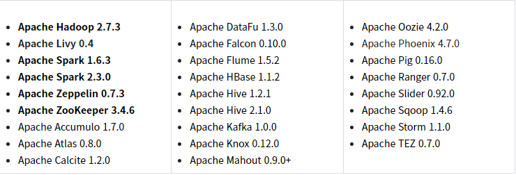
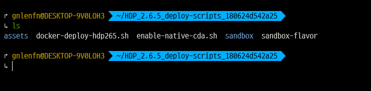
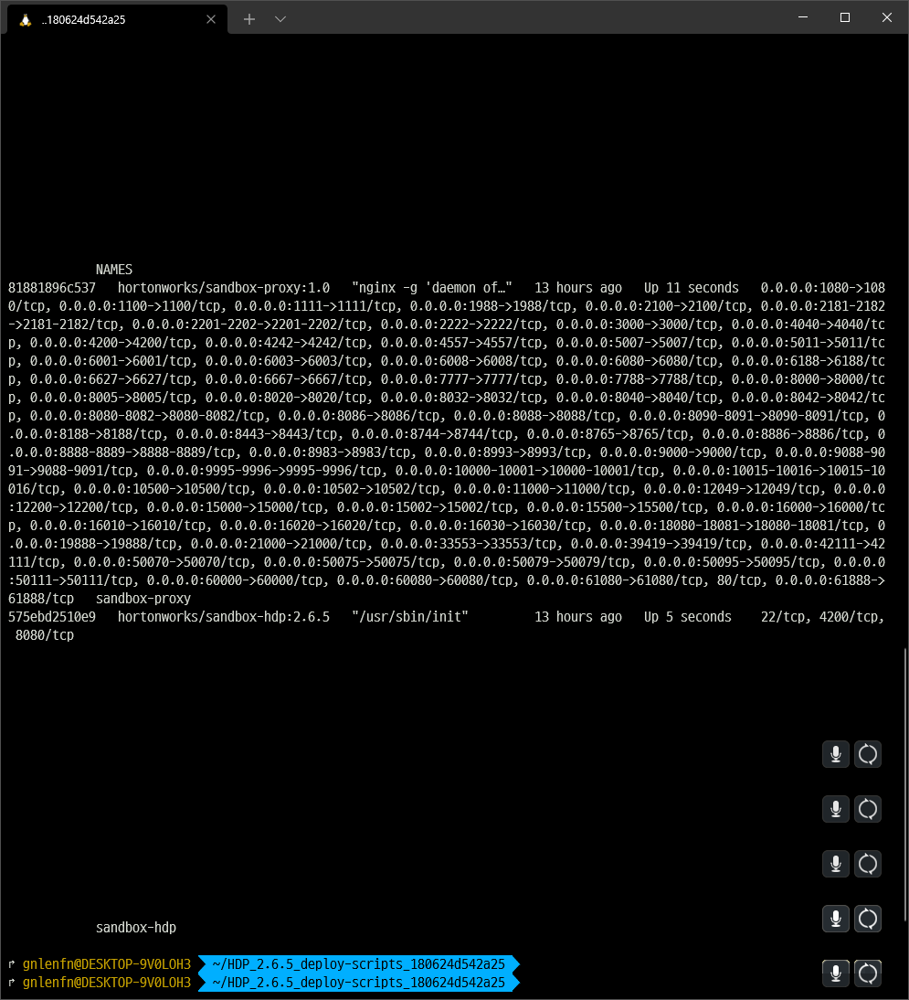
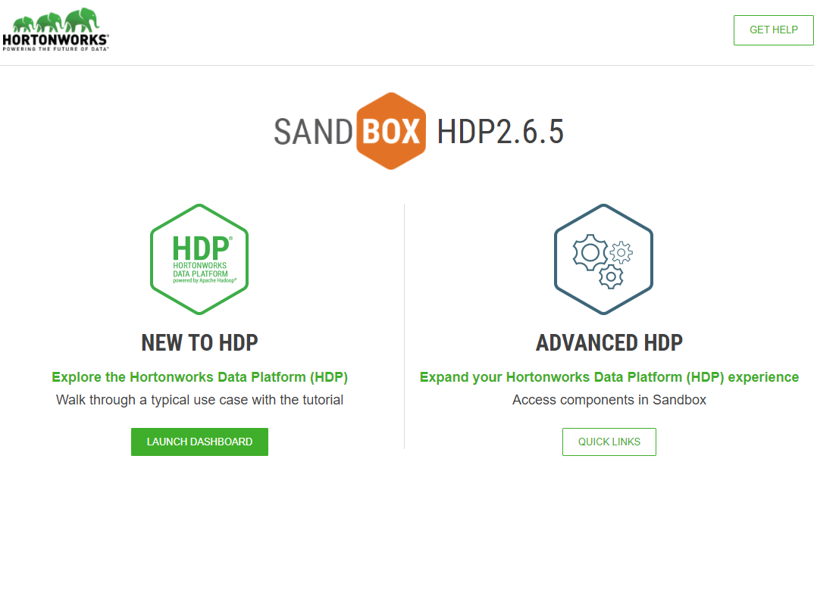
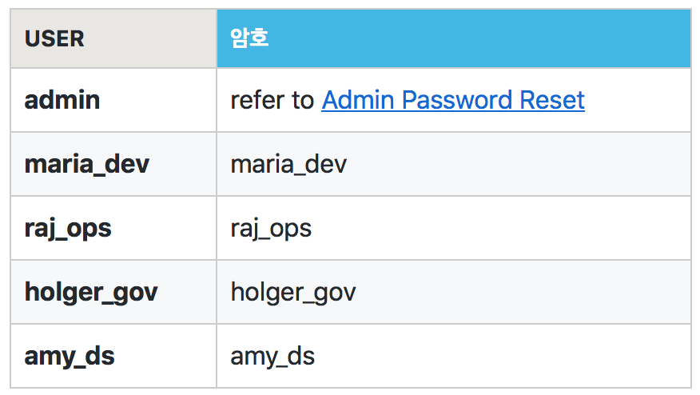

# Hadoop 환경 설치

State: Complete
최종 편집: 2021년 10월 29일 오전 11:48

Hortonworks HDP는 아파치에서 제공하는 Hadoop관련 프로젝트들을 하나의 가상 이미지로 묶은 것으로, 각 툴들을직접 설치하는 과정과 시간을 획기적으로 줄일 수 있다.

# 다운로드

[Hortonworks Sandbox Downloads](https://www.cloudera.com/downloads/hortonworks-sandbox.html)

링크를 통해 Cloudera 홈페이지에서 이미지를 다운 받을 수 있다. 버츄얼 박스 등의 가상머신 이미지 혹은 도커 이미지를 사용하면 될 것 같다. 나는 도커를 사용하기로 했다.

그리고 최신 버전은 3.0.1인데, 요구하는 최소 메모리가 상당해서 이전 버전인 2.6.5로 선택했다. 이것도 최소 10G의 메모리를 요구한다.



2.6.5 버전에 기본 보함된 프로젝트들이다.

# 도커 설치

도커는 윈도우에서도 설치해봤고, 리눅스에서도 해봤다. 

[Install Docker Desktop on Windows Documents](https://docs.docker.com/desktop/windows/install/)

공식 Document가 잘 설명해주고 있기 때문에 설치에는 문제가 없다. 이번에는 윈도우 환경에서 사용할 예정이다. 또한 bash shell 사용을 위해 Power Shell을 쓸 수도 있지만 WSL을 유용하게 써왔기 때문에 이번에도 쓸 것이다.

### Sandbox 설치

위의 링크에서 sandbox 설치 파일을 받으면 압축 파일에 쉘 스크립트가 들어있다.



이 중에서 `docker-deploay-{VERSION}.sh` 를 실행해주면 된다.

```python
bash ./docker-deploy-hdp265.sh
```

(설치 완료 후 적는 글이라 설치과정은 생략)

설치가 완료되면 컨테이너 2개가 실행되는 쉘 스크립트이다.



`sandbox-proxy`라는 컨테이너와 `sandbox-hdp` 라는 컨테이너 2개가 실행되게 된다.

### hosts 파일 수정

마지막으로 hosts 파일을 수정해준다

```python
echo '127.0.0.1 sandbox-hdp.hortonworks.com sandbox-hdf.hortonworks.com' | sudo tee -a /etc/hosts
```

# Ambari 접속

이제 `127.0.0.1:1080` 으로 접속하면 



이러한 페이지를 볼 수 있고 왼쪽의 LAUNCH DASHBOARD를 누르면 된다. 그러면 로그인을 해야하는데,



이러한 계정들이 있다고한다. 아직 각각의 기능에 대해서는 모르겠다.

### Reference

[Deploying Hortonworks Sandbox on Docker](https://www.cloudera.com/tutorials/sandbox-deployment-and-install-guide/3.html)

[The Ultimate Hands-On Hadoop: Tame your Big Data!](https://www.udemy.com/course/the-ultimate-hands-on-hadoop-tame-your-big-data/) —>installing hadoop 미리보기

[HDP Sandbox 2.6.5 Docker 설정과 Ambari 로그인하기](https://www.bearpooh.com/80)

[로컬 환경에서 sandbox hadoop cluster를 docker로 띄워보자](https://malgogi-developer.tistory.com/28)