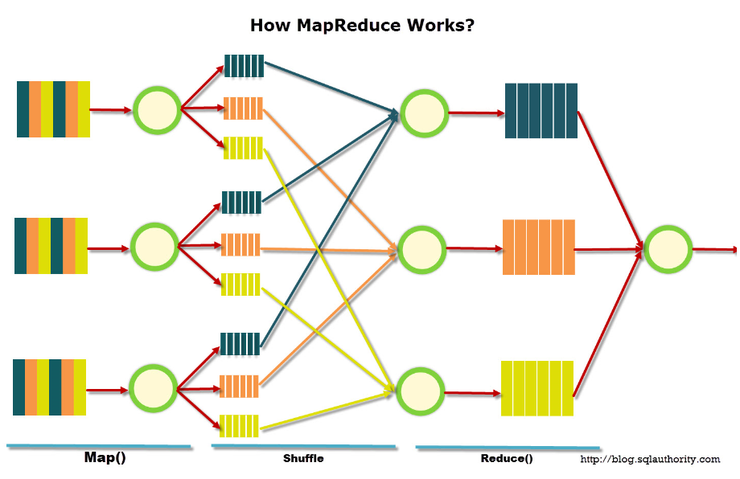
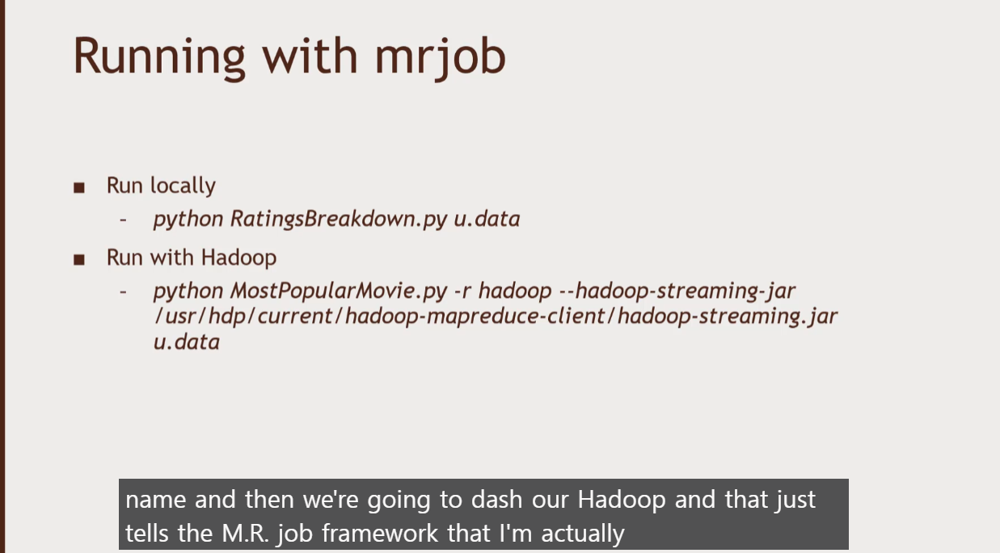
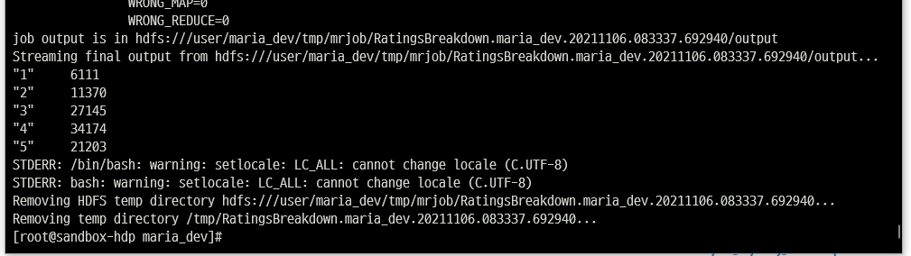

# MapReduce

맵리듀스는 여러 노드에 태스크를 분배하는 방법으로 Map과 Reduce 두 단계로 구성된다. 그리고 그 사이에는 sort와 shuffle 단계가 있다.

- Map은 key-value의 형태로 필터링을 한다
    - 해당 블록에 단어가 몇 개 있는지 찾는다고 하면, 단어: 개수 와 같이 나타내게 된다.
- Shuffle은 같은 key를 가지는 데이터끼리 분류하여 묶는다.
- Reduce는 각 key별 빈도수를 합산해서 출력한다.

로컬에서 mapreduce 코드는 그냥 파이썬으로 실행하면 되지만 하둡에서 실행시키려면 `-r hadoop` 명령어를 추가해야한다. 내가 진행한 HDP에서는 자동적으로 hadoop client를 찾지 못하기 때문에 그 부분을 추가해준 것이고 아마존 EC2등을 사용한다면 필요없는 부분이다.

위 이미지는 10만개의 영화 별점 중 각 점수 별로 몇 개의 평가가 있는지 세는 코드를 실행시킨 것