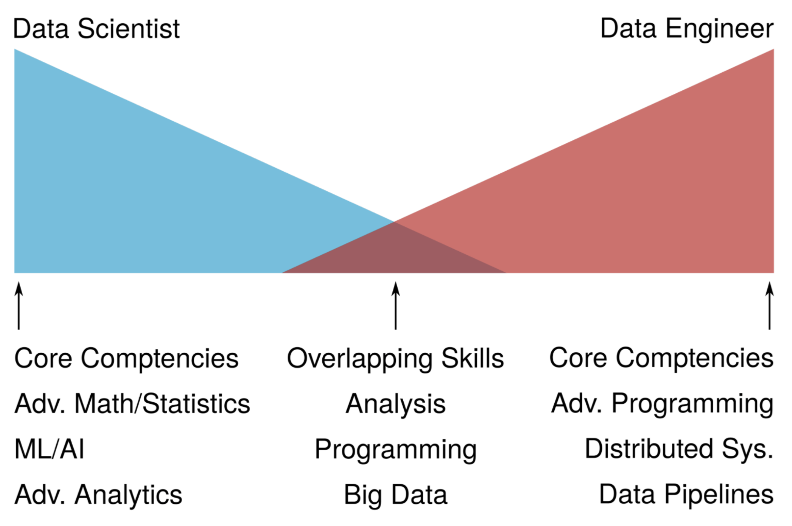

# 데이터 엔지니어링

데이터 엔지니어가 되겠다고 마음을 먹었지만 데이터 엔지니어링이 무엇인지 생각해보는 시간은 많이 가져보지 않았던 것 같다. 면접에서도 나왔던 질문이므로 다시 생각해보도록 하자.

## 빅데이터

언젠가부터 빅테이터라는 말이 주목받기 시작하고 기업은 서비스 개선에 전에는 사용하지 않던 데이터를 활용하고 광고나 마케팅에 사용했다. 이러한 성공 사례가 알려지면서 데이터에 대한 관심도 급격히 증가하고 데이터 분석 능력에 대한 수요가 증가했다. 

빅데이터에 대한 정의도 명확하게는 없지만 보통 RDB에서 처리할 수 없을 정도의 크기를 빅데이터라고 한다. 그리고 빅데이터의 특징으로 4V, 5V 등 여러가지가 있지만 nV로 나타낸다. 

1. Volume : 기존의 RDB시스템으로 다루기 힘든 크기
2. Variety : 정제된 정형 데이터 뿐 아니라 텍스트, 로그 등 다양한 비정형 데이터를 대상으로 분석
3. Velocity : 실시간 데이터 처리 및 분석

---

1. Veracity : 정확한 분석을 위해서는 데이터의 품질이나 정확도가 높아야함
2. Value 

## 데이터 분석 업무의 세분화

데이터를 다루는 일이 각광받고 종사자도 많아지면서 업무가 세분화 되었다. 대표적으로 데이터 사이언티스트와 데이터 엔지니어로 나누어본다면 다른 일을 하지만, 중첩된 업무도 존재한다.

회사에 따라 부르는 명칭이 다르기도 하고 맡는 업무의 범위가 달라질 수 있다. (나누지 않는 곳도 있다고 함) 

데이터 사이언티스트가 데이터를 가지고 분석하고 새로운 인사이트를 도출하거나 새로운 방향을 제시한다면 엔지니어는 데이터 분석 환경을 만든다든지, 쏟아져 들어오는 데이터를 어떻게 효율적으로 적재하고 자동화하는지를 고민한다고 할 수 있다.

](./img/flow.png)

[https://tech.kakao.com/2020/11/30/kakao-data-engineering/](https://tech.kakao.com/2020/11/30/kakao-data-engineering/)

## 데이터 엔지니어의 업무

### 1. 데이터 분석 환경 만들기

빅데이터 분석에서 다양한 데이터를 처리하기 때문에 (Variety) 필요로 하는 데이터가 산발적으로 퍼져있을 수 있다. A의 데이터는 MySQL을 사용하고 B의 데이터는 MongoDB를 사용한다면 두 데이터를 하나의 쿼리로 조회하기 힘들다. 

그래서 여기저기 퍼져있는 데이터를 하나의 저장소에 저장하고 (데이터 웨어하우스) 한 군데로 모아주는 작업(데이터 파이프라인)을 하는 것이 데이터 엔지니어이다.

Hadoop, 구글 BigQuery 등과 같은 별도의 저장소에 저장을 할 수 있고 Apache Airflow 등을 사용해 파이프 라인을 구축한다. → ETL

### 2. 데이터 분석

데이터 엔지니어도 데이터 분석 업무를 한다. 많은 경우 쿼리로 분석을 하기 때문에 SQL에 대한 이해가 필요하다. 그리고 시각화 도구를 사용해 BI ([참조링크](https://www.tableau.com/ko-kr/learn/articles/business-intelligence)) 환경을 만들기 때문에 시각화 툴에 대한 이해도 필요하다. Tablue, Google Data Studio 등에서 손쉽게 데이터 분석 결과를 확인하기 위해 데이터를 제공하는 역할을 한다고 할 수 있다. 그리고 미리 정해진 지표 등을 보여주는 대시보드를 제작하는 것도 할 것이다.

## 3. 협업

심화된 분석을 하는 데이터 사이언티스트와의 협업을 통해 더 나은 서비스를 제공하도록 할 것이다. 어떤 데이터가 필요한지 소통하여 원활하게 데이터를 제공하고 현재 서비스의 성과 분석을 통해 추가로 데이터를 수집하는 등의 업무가 필요하다.

이러한 과정에서 심화된 데이터 분석에 대한 지식이나 서비스를 만드는 백엔드 서비스에 대한 지식 등이 요구된다.