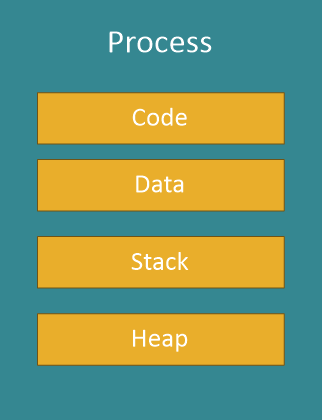
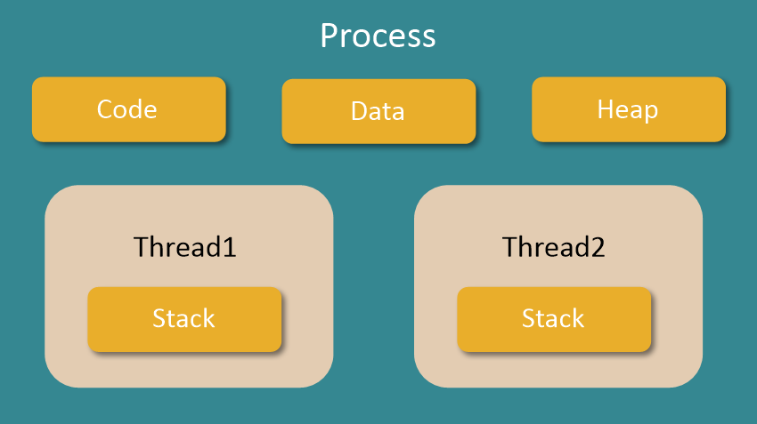
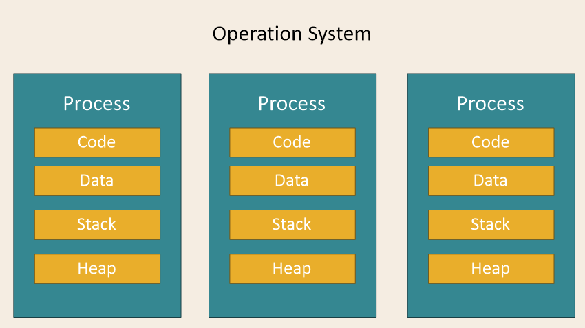

# 복기(2021.11.11)

최종 편집: 2021년 11월 13일 오후 7:03

## 자료구조 / 파이썬

- 힙이란? 힙의 시간복잡도 O(nlogn)인 이유?
- 파이썬에서 deep copy란 무엇인가?
- BFS와 DFS 각각 설명하고 차이점은?
- 객체란 무엇인가?
- 파이썬에서 상속의 특징?
    - 오버라이딩
    - 오버로딩
- GIL이 뭔지 아시나요?

## 데이터베이스

1. 기본키, 참조키, ER 다이어그램에 대해 설명하시오

 - **기본키**: 유일성과 최소성을 만족하는 속성의 집합을 후보키라 하고 후보키 중 선택된 기본으로 사용할 키. Null값 가지면 안됨, 값이 자주 변경되면 부적절, 단순한 후보키가 적당
- **참조키**: 어떤 릴레이션에 속한 속성이 다른 릴레이션의 기본키가 되는 키, 다른 릴레이션의 기본키를 참조해야 하며 같은 도메인을 가져야 한다
- **ER 다이어그램**: 개체-관계 모델링을 그림으로 표현한 것. 개체 간의 관계, 속성을 그림으로 표현

2. 트랜잭션에 대해 아는대로 설명하시오

  

- 트랜잭션이란 하나의 작업을 수행하는데 필요한 연산을 모아놓은 것
    - 트랜잭션의 특성(ACID)
        - 원자성(Atomicity) : 연산이 모두 실행되거나 모두 실행되지 않아야 함
        - 일관성(Consistency) : 트랜잭션이 성공적으로 이루어져도 DB는 일관된 상태 유지
        - 격리성(Isolation) : 현재 수행중인 트랜잭션이 끝나기 전 중간 단계에 다른 트랜잭션이 접근할 수 없다
        - 지속성(Durability) : 트랜잭션이 반영되면 손실되면 안된다. 장애가 발생해도 복구 가능해야 한다.
- commit이 필요한 연산과 필요 없는 연산?
    - DML → commit이 항상 필요 — SELECT, INSERT, UPDATE, DELETE... (데이터 조작 언어)
    - DDL→ commit 불필요 (auto commit) — CREATE, ALTER, RENAME... (데이터 정의 언어)
    - DCL → commit 불필요 (auto commit) — 권한 부여 명령어

- Outer join에 대해 설명하시오

## 운영체제

1. 멀티프로세스와 멀티쓰레드의 차이

[[OS] 프로세서, 프로세스, 프로그램, 스레드](https://velog.io/@chy0428/OS-%ED%94%84%EB%A1%9C%EC%84%B8%EC%84%9C-%ED%94%84%EB%A1%9C%EC%84%B8%EC%8A%A4-%ED%94%84%EB%A1%9C%EA%B7%B8%EB%9E%A8)  
[[OS] 멀티프로세싱, 멀티프로그래밍, 멀티태스킹, 멀티스레딩](https://velog.io/@chy0428/OS-%EB%A9%80%ED%8B%B0%ED%94%84%EB%A1%9C%EA%B7%B8%EB%9E%98%EB%B0%8D-%EB%A9%80%ED%8B%B0%ED%94%84%EB%A1%9C%EC%84%B8%EC%8B%B1)
    

    
프로세스와 쓰레드

    

        

        
프로세스

        

- 프로세스는 운영체제로부터 시스템 자원을 할당 받는 단위
- 메모리에 올라와 실행되고 있는 프로그램의 인스턴스
- Code: 코드 자체를 구성하는 메모리 영역                
- Data: 전역변수, 정적변수, 배열 등 초기화된 데티어
- Stack: 지역변수, 매개변수, 리턴 값 등 임시 메모리 영역            
- Heap: 동적 할당시 사용                        

        

        

        

        
쓰레드

        

- 한 프로세스 내에서 동작하는 여러 실행의 흐름
- 프로세스 하나의 자원을 공유하면서 일련의 과정 여러개를 동시에 실행
- 한 프로세스 내의 주소 공간이나 자원을 대부분 공유
- 하나의 프로세스는 여러개의 쓰레드를 가질 수 있음 → 멀티쓰레드
- 기본적으로 하나의 프로세스가 실행되면 하나의 쓰레드가 생성되고(메인 쓰레드) 추가로 쓰레드를 생성하지 않는 한 모든 프로그램 코드는 메인 쓰레드에서 실행            

        

        

    

    

    

    
멀티프로세스

    

            
- 두 개 이상 다수의 프로세서가 하나 이상의 작업을 동시에 처리하는 것 (병렬처리) → 하나의 컴퓨터에 여러개의 CPU
- 각 프로세스 간 메모리 구분이 필요하거나 독립된 주소 공간을 가져야할 때 사용
- 장점
    - 독립된 구조로 안정성 높음
    - 프로세스 중 하나에 문제가 생겨도 다른 프로세스에 영향을 주지 않음
- 단점
    - 작업량이 많을 수록 context switching 자주 일어나 오버헤드로 인한 성능저하
    

    
           
    

    
멀티 쓰레드

    

- 하나의 프로세스에서 여러 스레드로 자원을 공유하며 작업을 나누어 수행하는 것
- 장점
    - 시스템 자원 소모 감소 → 자원 효율성 증대
    - 지스템 처리율 상승 : 스레드간 데이터를 주고받는 것이 간단해져서 자원 소모 감소
    - 프로그램 응답시간 단축
- 단점
    - 동기화 문제(병목, 데드락)
    - 주의 깊은 설계 필요로 하고 디버깅 힘들다
    - 하나의 스레드에 문제가 생기면 전체 프로세스가 영향 받음
    - 단일 프로세스 시스템에서 효과 미미
    

    

    

2. 쓰레드와 프로세스의 차이를 메모리의 관점에서 설명하시오

       
  {토글리스트의 content}

 

    - 사용자모드와 커널모드는 어떻게 다른가?
    - 사용자 모드에서 커널모드로 전환하는 방법은?
3. 문맥교환이란 무엇인가?
    - 문맥교환의 장점과 단점
    

## 빅데이터

- 빅데이터는 어떤 특징을 가지고 있나? → 3V?
- 구조화된 데이터와 구조화되지 않은 데이터는 무엇인가
- 싱글톤..?
- Hadoop
    - HDFS는 어떤 구조로 이루어져 있나, 특징
    - Map reduce는 어떤 형태로 이루어지나
    - Spark란?
    

## 일반 면접

- 왜 데이터 엔지니어에 지원했나?
- 데이터 엔지니어로 나를 뽑아야 하는 이유?
- 소통관련.. 가물가물..

<!-- 

{토글리스트의 title}

       
  {토글리스트의 content}

 
-->