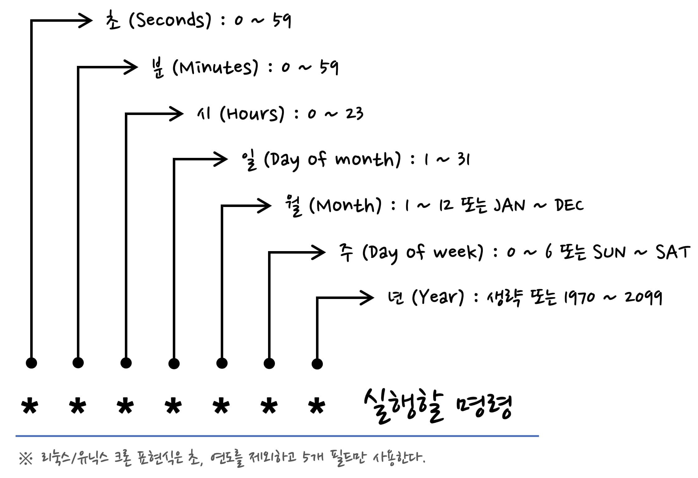

# Cron?

- 특정한 시간 또는 특정 시간 간격 마다 어떤 작업을 수행하게 해주는 명령어

# Cron 표현식



출처: [https://madplay.github.io/post/a-guide-to-cron-expression](https://madplay.github.io/post/a-guide-to-cron-expression)

```bash
min - hour - day - month - week - 'command'
```

| 필드명       | 값의 범위           | 특수문자      | 비고   |
|--------------|---------------------|---------------|--------|
| 초 (Seconds) | 0 ~ 59              | , - * /       | 리눅스/유닉스에서 사용안함 |
| 분 (Minutes) | 0 ~ 59              | , - * /       |        |
| 시 (Hours)   | 0 ~ 23              | , - * /       |        |
| 일 (Day)     | 1 ~ 31              | , - * ? / L W |        |
| 월 (Month)   | 1 ~ 12 or Jan ~ Dec | , - * /       |        |
| 요일 (Week)  | 0 ~ 6 or SUN ~ SAT  | , - * ? / L W |        |
| 연도 (Year)  |                     |               | 리눅스/유닉스에서 사용안함 |


### 특수문자의 의미

- * : 모든 값을 뜻합니다.
- ? : 특정한 값이 없음을 뜻합니다.
- - : 범위를 뜻합니다. (예) 월요일에서 수요일까지는 MON-WED로 표현
- , : 특별한 값일 때만 동작 (예) 월,수,금 MON,WED,FRI
- / : 시작시간 / 단위  (예) 0분부터 매 5분 0/5
- L : 일에서 사용하면 마지막 일, 요일에서는 마지막 요일(토요일)
- W : 가장 가까운 평일 (예) 15W는 15일에서 가장 가까운 평일 (월 ~ 금)을 찾음
- \# : 몇째주의 무슨 요일을 표현 (예) 3#2 : 2번째주 수요일


### 예시
1. 매일 2AM에 실행 : `0 2 * * * ./test.sh` 
2. 매분 실행 : `* * * * * * ./test.sh` 
3. 월-토마다 1AM에 [dcs.sh](http://dcs.sh) 실행 : `0 1 * * 1-6 ihd /usr/bin/dcs.sh`
    
    (리눅스마스터 2급 2017 1회 기출)
    
4. 매년 1월부터 10월까지 두달 주기로 1일 오전 7시 정각에 [vipcheck.sh](http://vipcheck.sh) 실행: `0 7 1 1-10/2 /bin/vipcheck.sh`
    
    (리눅스마스터 2급 2016 1회 기출)


- [cronmaker](http://www.cronmaker.com/;jsessionid=node01qi0s11afximzokil33mq5f8i2321268.node0?0)