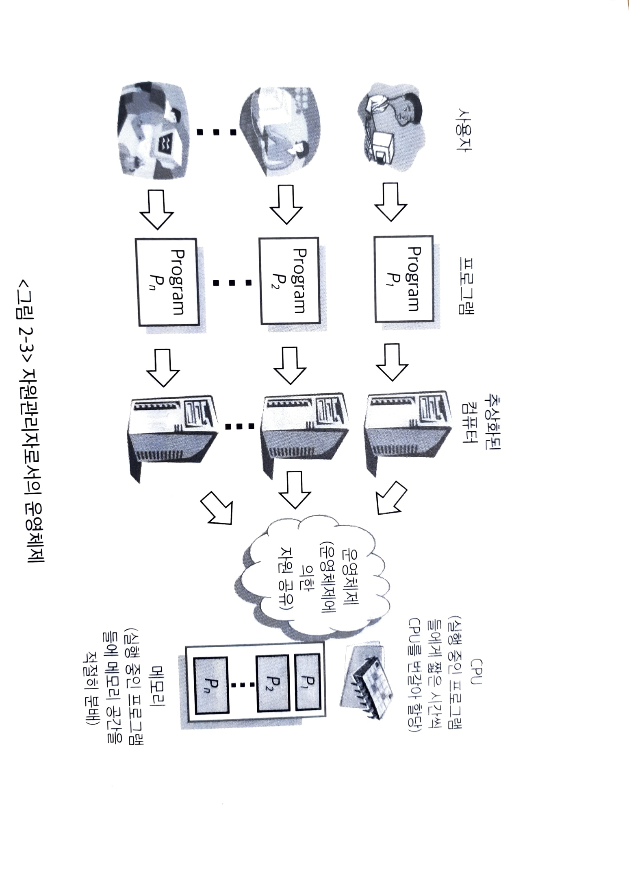
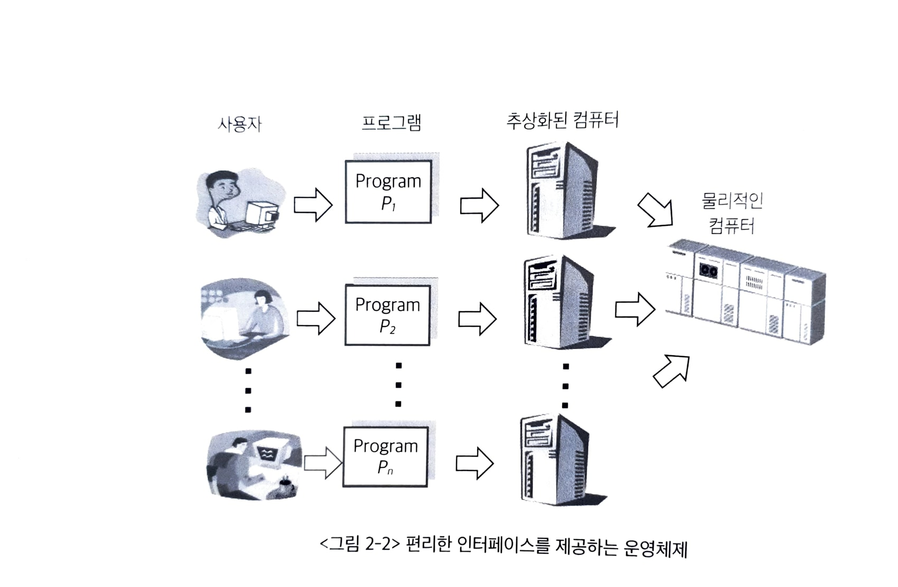

# 운영체제 개요

State: Writing
유형: 강의
최종 편집: 2021년 10월 21일 오후 7:55

# 1. 운영체제의 정의

- PC를 동작시키기 위해 필요한 기본적인 소프트웨어
- 메모리에 상주하는 운영체제의 부분을 커널이라 함
    - 운영체제도 소프트웨어이기 때문에 메모리에 올라가서 동작한다

# 2. 운영 체제의 기능

1. 컴퓨터 시스템 내의 자원을 효율적으로 관리
    
    
    
    1. 운영체제의 핵심기능
    2. 자원을 효율적으로 관리해 가장 좋은 성능을 내도록 한다. 동시에 자원이 사용자 및 프로그램들 간에 형평성 있게 분배되도록 하는 역할도 함께 해야한다.
    
2. 컴퓨터 시스템을 편리하게 사용할 수 있는 환경 제공
    
    
    
    1. 여러 사용자 및 프로그램에게 독자적으로 컴퓨터를 사용하는 것 처럼 착각하게 만듬
    2. 하드웨어를 직접 다루는 부분은 운영체제가 대신하여 그에 대해 자세히 모르더라도 사용할 수 있게 해준다

# 3. 운영체제의 분류

1. 다중 작업에 따른 분류
    1. single tasking
        - DOS와 같은 운영체제는 한 번에 하나의 작업만 가능한 single tasking
        - 현재의 운영체제들은 multi tasking을 기본적으로 지원
    2. multi tasking
        - 운영체제가 다중작업을 처리할 때에는 여러 그로그램이 CPU와 메모리를 공유하게 되는데, 짧은 시간 규모로 여러 프로그램들이 CPU에서 번걸아 실행되면서 사용자가 마치 동시에 실행되는 것 처럼 느끼게 한다 —> **시분할 시스템**
        - 메모리 공간을 분할해 여러 프로그램을 동시에 처리하는 것을 multi-programming이라고 함
        - 사용자의 관점에서는 입력 결과를 곧바로 보여주기 때문에 interactive system이라고도 부름
        - multi tasking, time sharing, multi-programming, interactive system 모두 여러 프로그램이 하나의 컴퓨터에서 동시에 실행되는 것을 일컫는다
        - 이에 반해 multi-processor system은 하나의 컴퓨터에 여러개의 CPU가 존재하는 것을 의미
            - 위의 것들은 하나의 CPU가 동시에 여러 작업을 하는 것을 말함
            - multi-processor는 CPU가 여러개 존재하기 때문에 다중 작업 처리가 더빨라지지만 복잡한 메커니즘을 필요로 한다
2. 단일 사용자용 vs 다중 사용자용
    1. 단일 사용자용
        - 한 번에 하나의 사용자만 쓸 수 있다
        - DOS, 윈도우, 초창기 컴퓨터의 펀치카드 시스템
    2. 다중 사용자용
        - **시분할 방식**으로 여러 사용자의 작업을 짧은 시간 단위로 번갈아 가며 수행하면 여러명의 사용자가 마치 혼자 컴퓨터를 독점한 것 처럼 느끼게 해줌
        - **실시간 방식**은 일정 시간 안에 작업이 완료되지 못할 경우 동작이 안되거나 큰 위험을 초래할 가능성이 있는 시스템에서 사용
            - 원자로, 미사일 제어 시스템 등 주어진 시간을 지키지 못할 경우 매우 위험한 경우 hard realtiem system이라 함
            - 동영상 스트리밍 등의 경우 시간이 지켜지지 않으면 영상이 재생되지 않는데 (버퍼링) 이러한 경우를 soft realtime system이라고 함
            

# 4. 윈도우 vs 유닉스

1. 윈도우
    - 마이크로소프트에서 만들었으며 DOS에서 시작해 현재 윈도우 11까지 출시
    - 출발점이 single tasking의 DOS였고 단일 사용자용이었으며 점점 발전해왔다
    - 유닉스에 비해 안정성이 떨어지지만 사용이 편리한 여러 기능을 제공하기 때문에 일반 사용자들이 친숙하게 사용할 수 있음
    - 현재는 안정성도 많이 발전됐다고 평가 받음 (윈도우 NT)
2. 유닉스
    - 1969년 최초로 개발 되었으며 프로그램 개발 환경을 위해 설계됨
    - 이식성이 좋고 커널의 크기가 작으며 오픈소스 프로그램이다
        - 이식성: 해당 소프트웨어를 다른 기종의 기계로 얼마나 옮기기 용이한가
    - C언어로 작성되어 소스코드 이해가 쉽고 이로인해 이식성 good
    - 대형 컴퓨터 및 전문적인 목적으로 사용되기 적합
    - 오랜 전통만큼 안정성이 가장 큰 장점
    - 리눅스의 등장으로 일반 사용자들도 사용하는 빈도 상승
    

# 5. 운영체제의 자원 관리 기능

1. CPU 스케쥴링
    - CPU를 가장 효율적으로 사용하면서 특정 프로세스가 불이익을 받지 않도록 하는 것
    - FCFS, Round Robin, Priority 기법 등이 있음
        1. First Come, First Served (선입선출)
            - CPU를 필요로 하는 프로세스가 있을 때 먼저 CPU를 얻는 프로세스가 모두 실행 되면 다음 프로세스 진행
            - 긴 수행시간을 가진 프로세스 다음에 짧은 수행시간을 가진 프로세스가 오는 경우 효율적이지 못함
        2. Round Robin 기법
            - CPU를 할당 받아 한 번 사용할 수 있는 시간을 제한
            - 단위 시간 내에 작업을 마치지 못하면 다시 큐의 맨 뒤로 이동
        3. Priority 기법 (우선순위)
            - 대기중인 프로세스에 우선순위를 부여하고 우선순위가 높은 프로세스부터 수행
            - 계속해서 우선순위가 높은 프로세스가 들어오면 실행되지 못하는 프로세스 생김
2. 인터럽트
    - 주변장치 및 입출력 장치를 관리하는 메커니즘
    - CPU 스케쥴링에 따라 작업을 수행하다가 인터럽트가 발생하면 하던 일을 멈추고 인터럽트에 의한 요청 작업을 수행
        - ex) 키보드 입력이 들어오면 인터럽트를 발생시켜 사용자로부터 입력이 들어옴을 알림
    - 인터럽트 처리가 완료되면 기존에 하던 작업을 이어서 진행
    - 원래 하던 작업으로 돌아가기 위해 작업의 상태를 저장해두어야 한다
    - 주변장치들은 각 장치마다 장치에서 발생하는 일을 관리하기 위해 일종의 CPU인 컨트롤러가 있음 —> 여기서 인터럽트 발생시킴