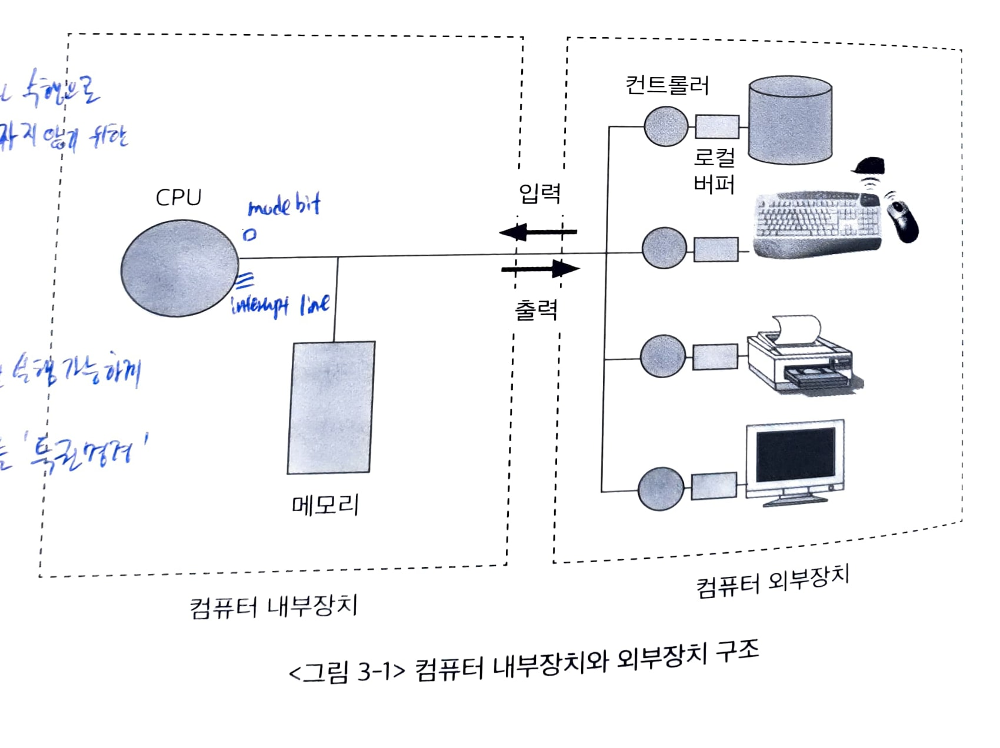
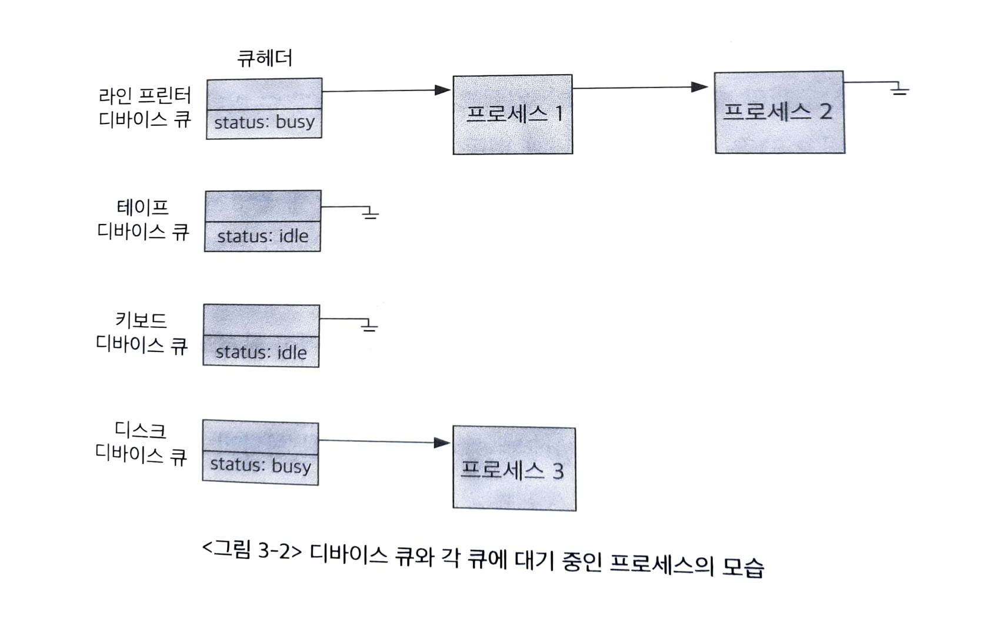
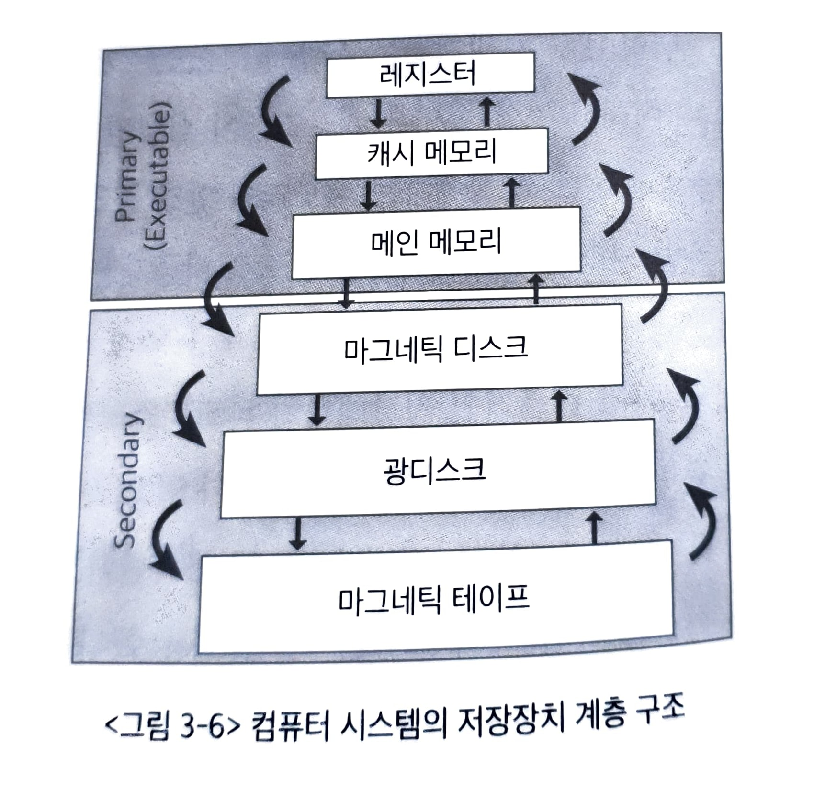

# 컴퓨터 시스템의 동작 원리

State: Writing
최종 편집: 2021년 10월 26일 오후 11:02

## 1. 컴퓨터 시스템의 구조

컴퓨터는 내부장치인 CPU, 메모리와 외부장치인 디스크, 키보드, 마우스, 모니터 등으로 구성된다. 외부장치에서 내부장치로 데이터를 읽어와 각종 연산을 수행한 후 그 결과를 다시 외부장치로 내보내는 방식으로 작업을 처리한다.

각 하드웨어 장치에는 컨트롤러라는 것이 있다. 각 하드웨어를 제어하는 작은 CPU라고 할 수 있다.

운영체제 역시 메모리에 올라가 수행되는 프로그램으로 운영체제는 부팅 후 항상 메모리에 올라가 있으면서 각종 자원을 관리한다. 하지만 모든 부분이 올라가면 낭비가 심하므로 그 중에 항상 메모리에 올라가 있는 부분을 커널이라 한다.

## 2. CPU연산과 I/O연산

컴퓨터에서 연산을 하는 것은 CPU가 무언가 일을 한다는 뜻이다. 그리고 입출력 장치와 CPU는 각각 동시에 작업을 수행할 수 있다. 각 장치는 장치를 제어하기 위한 컨트롤러가 있고 컨트롤러는 장치로부터 오고가는 데이터를 임시로 저장하기 위한 로컬 버퍼를 가지고있다.

컨트롤러는 로컬 버퍼에서 인터럽트를 발생시켜 CPU로 보내 현재 상태를 알린다. 

인터럽트는 컨트롤러들이 CPU의 서비스를 필요로 할 때 이를 알리는 방법이다. CPU는 인터럽트 라인이 있어서 하던 작업 중 인터럽트 라인에 신호가 들어오면 진행중이던 작업을 멈추고 인터럽트와 관련된 작업을 먼저 수행한다.

## 3. 인터럽트의 일반적 기능

인터럽트에는 하드웨어 인터럽트와 소프트웨어 인터럽트가 있다.

CPU의 서비스가 필요할 때 인터럽트 라인으로 신호를 보내는데, 하드웨어의 컨트롤러가 이 신호를 보내면 하드웨어 인터럽트이다. 반면 exception, system call 등 비정상적인 작업을 시도하거나 자신의 메모리 영역 바깥을 접근하려는 시도 등은 소프트웨어 인터럽트라고 할 수 있다. 

인터럽트 처리를 완료하고 나면 원래 수행하던 작업으로 돌아가 이어서 작업을 진행한다. 이때 되돌아갈 위치를 알아야 하므로 인터럽트 처리 전에 어떤 작업을 하고 있었는지 반드시 저장해야 한다.

- 스택: 실행 중인 함수에서 다른 함수를 호출한 경우 호출된 함수의 종류 후 원래 실행중인 위치로 돌아가기 위해 복귀 주소를 저장하는 영역
- 데이터: 전역 변수 등 프로그램이 사용하는 데이터가 저장되는 공간
- 코드 : 프로그래머가 작성한 코드가 기계어 명령으로 저장되는 영역. CPU가 이부분을 읽으면서 수행

## 4. 입출력 구조

입출력 (I/O)란 컴퓨터 시스템이 외부 주변 장치와 데이터를 주고받는 것. 동기식 입출력와 비동기식 입출력이 있다.

### 동기식 입출력 (synchronous I/O)

입출력 요청을 했을 때 그 작업이 완료된 후 그 프로그램이 후속 작업을 이어갈 수 있는 방식

프로그램이 디스크에서 어떤 정보를 읽어오라는 요청을 했을 때, 디스크 입출력이 완료되기 전에는 어느정도 시간이 걸리고 그 프로그램은 다음 명령을 수행하지 않고 기다린다. 그리고 입출력이 완료되고 인터럽트를 통해 그 사실이 전달되면 CPU 제어권이 다시 그 프로그램으로 넘어가 다음 작업을 수행할 수 있다.

동기식 입출력에서 CPU는 입출력 연산이 끝날 때까지 인터럽트를 기다리며 자원을 낭비할 수 있다.

동기식 입출력에서는 장치의 입출력 명령을 순서대로 실행하기 위해 큐를 두고 순서대로 처리할 수 있도록 한다. 

각 장치마다 큐가 있고 입출력이 완료될 때까지 다른 관련없는 프로그램을 수행하도록 하고 입출력이 완료됐다는 인터럽트가 오면 다시 돌아와 작업이 이어진다.

### 비동기식 입출력 (asynchronous I/O)

비동기식 입출력은 입출력 연산을 요청한 후 바로 다시 CPU 제어권을 해당 프로그램에 부여하는 것이다.

프로그램 내에서 입출력과 관계없는 작업이 있을 수 있기 때문에 그것들은 먼저 수행하고 데이터가 반드시 있어야 수행할 수 있는 작업을 입출력이 완료된 후 진행한다. 이 역시 인터럽트를 통해 입출력 완료를 알리고 그 후에는 데이터를 필요로 하는 명령을 수행할 수 있게 된다.

일반적으로는 입출력이 완료될 떄까지 그 프로그램을 봉쇄시키는 동기식 입출력을 사용한다. 기다리는 프로세스를 줄세워 관리함으로써 동기성을 보장하게 된다.

## 5. 저장 장치의 계층 구조

컴퓨터 시스템의 저장 장치는 주 기억 장치와 보조 기억 장치로 구분된다. 

- 주 기억 장치는 보통 메모리로 부르며 전원이 꺼지면 내용이 사라지는 휘발성의 RAM을 일컫는다
- 보조 기억 장치는 전원이 꺼져도 내용을 기억하는 비휘발성 메모리이며 하드디스크, SSD 등이 있다
- 저장 장치는 가장 빠른 저장 장치부터 느린 저장 장치까지 계층 구조를 이룬다

저장 장치 계층의 최상위는 CPU를 구성하는 레지스터부터, 캐시 메모리, 메인 메모리 등의 휘발성 메모리가 있고 그 아래 비휘발성의 보조 기억 장치로 구성된다. 상위 저장 장치일 수록 속도가 월등히 빠르지만 용량은 적다.

하지만 당장 필요한 정보만 선별적으로 저장하면 하위의 큰 용량을 가진 것 처럼 성능을 낼 수 있다. ex) 캐싱 기법

## 6. 하드웨어 보안

각 프로그램들이 다른 프로그램의 실행을 방해하거나 프로그램 간의 충돌을 막기 위한 보안 기법이 필요하다. 이를 위해 운영체제는 커널 모드, 사용자 모드를 지원한다.

- 커널 모드: 운영체제가 CPU의 제어권을 가지고 모든 종류의 명령을 실행할 수 있음
- 사용자 모드: 일반 사용자 프로그램이 실행되며 제한적인 명령만 수행할 수 있음

시스템에 중요한 영향을 끼치는 명령은 커널 모드로만 수행할 수 있게 하여 하드웨어 보안을 유지한다. 이때 두 모드를 구분하기 위해 모드 비트가 있음

모드 비트가 0인 경우 커널 모드, 1인 경우 사용자 모드이다. 시스템의 보안과 관련된 명령들을 특권 명령이라고 하며 특권 명령은 모드 비트가 0인 경우에만 실행할 수 있다.

## 7. 메모리 보안

여러 프로그램이 메모리에 동시에 올라가서 실행되기 때문에 다른 프로그램의 메모리를 침범하지 않도록 하는 것이다. 기준 레지스터 (base register)와 한계 레지스터(limit register)를 사용해서 프로그램이 접근하려는 메모리의 부분이 적절한지 판단하고 메모리를 보호한다.

1. 메모리 접근 연산이 있을 때 마다 해당 위치가 base register와 limit register에 맞는 합법적인 범위인지 체크
2. 사용자 프로그램은 base register와 limit register 값 사이의 주소 영역만 접근 가능하며 벗어날 경우 예외 인터럽트를 발생시킨다
3. 이러한 인터럽트 신호가 들어오면 CPU는 강제로 해당 프로그램을 종료시킨다

반면 커널 모드에서는 메모리에 무제한 접근이 가능하다.

## 8. CPU 보호

CPU가 하나의 프로그램에 의해 독점되는 것을 막기 위해 timer라는 하드웨어를 사용한다. 정해진 시간이 지나면 인터럽트를 발생시켜 운영체제에게 CPU 제어권을 넘기는 것이다.

- 타이머는 일정 시간 단위로 세팅될 수 있고 매 클럭 틱 마다 1씩 감소하고 0이 되면 인터럽트를 발생시킴
- 시분할 시스템에서 현재 시간을 계산하기 위해 널리 사용됨
- 타이머 값을 세팅하는 명령을 로드 타이머(load timer)라고 하며 이 역시 특권 명령이다