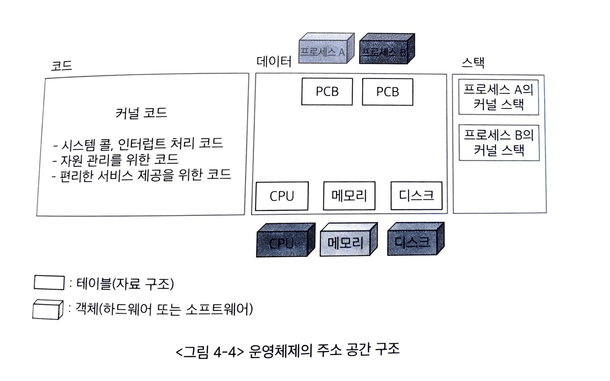
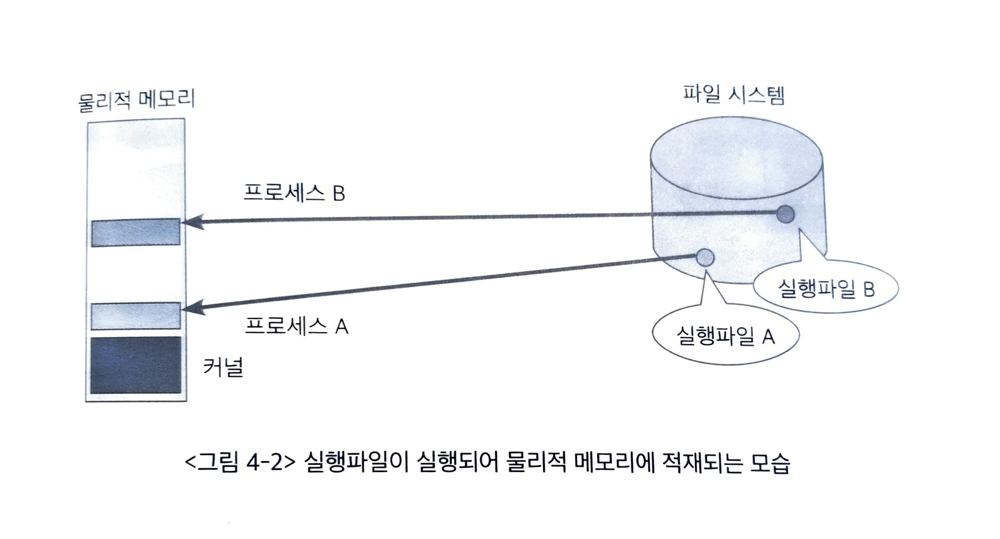
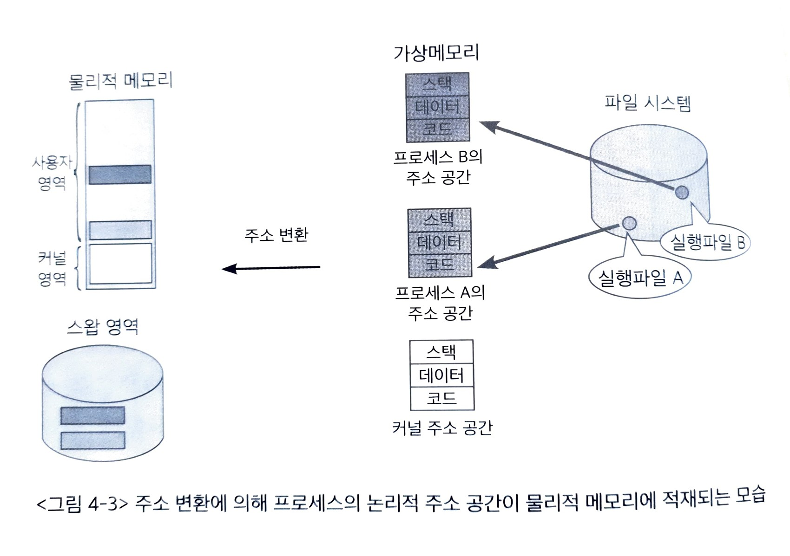
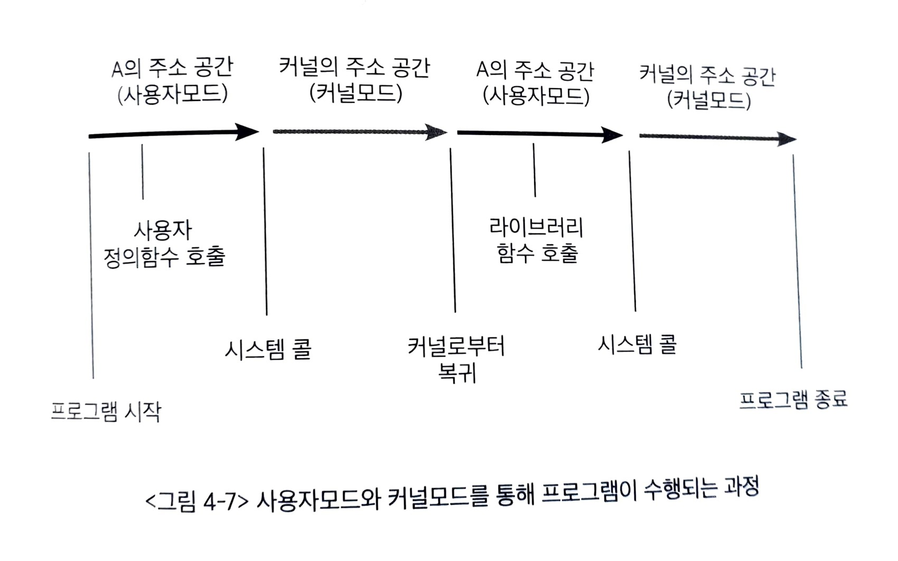

# 프로그램의 구조와 실행

최종 편집: 2021년 10월 28일 오후 9:19

## 용어 정리

- 코드 : CPU에서 수행할 수 있는 기계어가 저장되는 공간
- 데이터 : 전역 변수 등 프로그램이 사용하는 데이터를 저장하는 공간
- 스택 : 함수가 호출될 때 호출된 함수의 수행을 마치고 복귀해야 하는데, 복귀할 주소 및 데이터를 임시로 저장하는 공간
- 시스템 콜 : 사용자 프로그램이 스스로 특권 명령을 수행할 수 없기 때문에 운영체제에게 특권 명령 대행을 요청하는 것
- 프로세스 : 현재 수행중인 프로그램
- PCB : Process Control Block. 각 프로세스의 상태, CPU 사용 정보, 메모리 사용 정보 등을 저장하기 위한 것

- 커널의 스택은 다른 일반 프로세스의 스택과 달리 수행중인 프로세스마다 별도의 스택을 두어 관리한다. 프로세스가 특권 명령을 수행하기 위해 커널에 정의된 시스템 콜을 호출하고 시스템 콜 내부에서 또 다른 함수를 호출하는 경우 그 복귀 주소는 커널 내의 주소가 되어야 하기 때문이다

- 프로그램이 사용하는 함수는
    - 사용자 정의 함수 —> 프로그래머가 직접 작성
    - 라이브러리 함수 —> 누군가 작성해 놓은 것을 불러와서 사용
    - 커널 함수 —> 운영체제 커널의 코드에 정의된 함수
    
    세 가지가 있다. 위 2개의 함수는 프로그램의 코드 영역에 존재하고 커널 함수는 커널의 주소 공간에 존재한다. 즉, 운영체제의 함수를 프로그램이 호출하여 사용하는 것이다. 
    
    