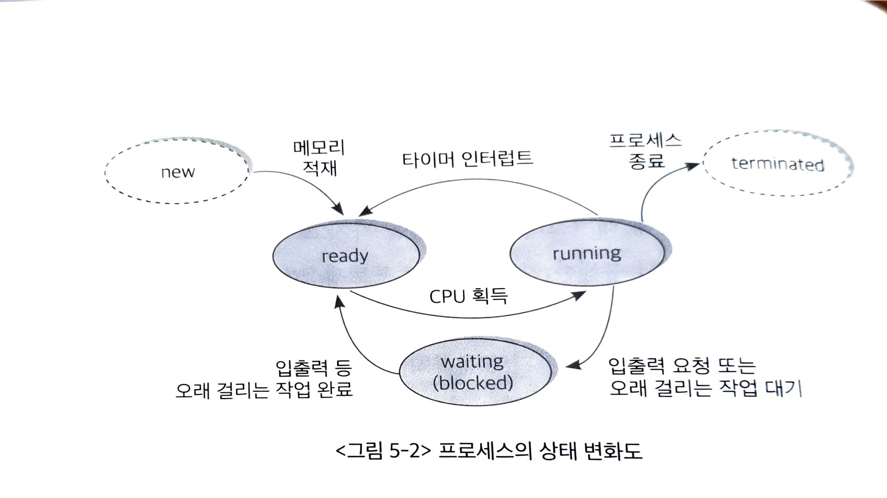
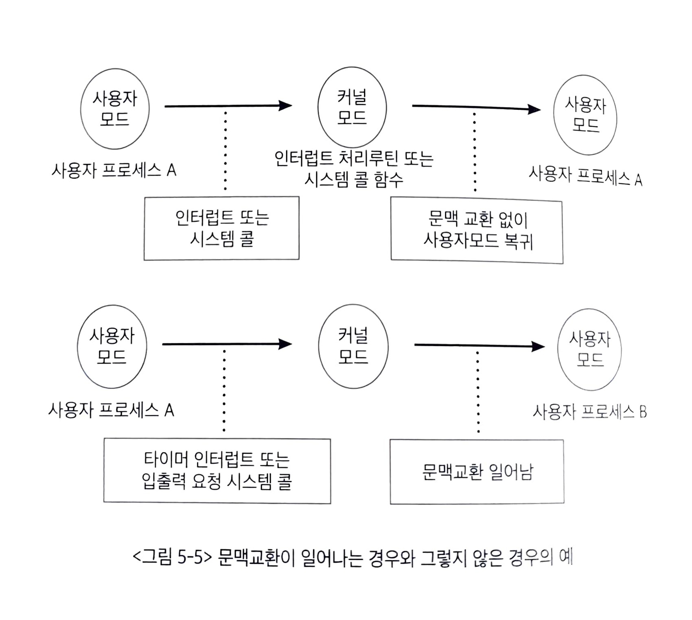
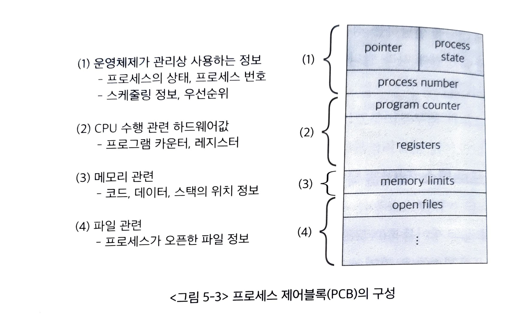

# 프로세스 관리
- [프로세스 개념](#프로세스의-개념)
- [프로세스의 상태](#프로세스의-상태)
- [문맥교환](#문맥교환-context-switch)
- [프로세스 제어 블록](#프로세스-제어-블록-(PCB))

## 프로세스의 개념

- 프로세스란? 수행 중인 프로그램
- 프로세스의 문맥: 프로세스가 현재 어떤 상태에서 수행되고 있는지 알기 위해 필요한 정보
- 어떤 프로세스가 CPU를 다시 획득해 작업을 재개하는 시점에서 이전에 어느 부분까지 명령을 수행했는지 정확한 상태를 재현해야 한다. 이때 정확한 재현을 위해 필요한 정보가 **프로세스 문맥**
    - 하드웨어 문맥 : CPU의 수행상태,
    - 프로세스 주소 공간 : 코드, 데이터, 스택으로 구성된 독자적인 주소 공간
    - 커널 상의 문맥 : 운영체제가 프로세스를 관리하기 위한 자료구조, PCB와 커널 스택

## 프로세스의 상태

프로세스의 상태는 실행(running), 준비(ready), 봉쇄(block) 세 가지 상태가 있다.

- 실행 : CPU를 보유하고 기계어 명령을 실행하고 있는 상태. 일반적으로 CPU가 하나 이므로 실행상태의 프로세스는 매 시점 한 개 뿐
- 준비 : 언제든 CPU를 얻으면 실행할 준비가 된 상태 하지만 아직 CPU를 할당받지 못한 상태
- 봉쇄 : CPU를 할당 받더라도 당장 실행할 수 없는 상태 —> 아직 I/O작업이 안끝나서 대기 중인 상태 등

## 문맥 교환 context switch

실행시킬 프로세스를 변경하기 위해 원래 수행 중이던 프로세스의 문맥을 저장하고 새로운 프로세스의 문맥을 세팅하는 과정을 문맥 교환이라 한다. 하나의 사용자 프로세스로부터 다른 사용자 프로세스로 CPU의 제어권이 이양되는 과정이라 할 수 있다.

1. 사용자 프로세스가 CPU를 할당 받고 실행되던 중 인터럽트가 발생하면 CPU 제어권은 운영체제로 넘어가고 운영체제는 수행중이던 프로세스의 문맥을 저장한 후 새로운 프로세스에게 CPU를 넘긴다
2. 문맥교환 중에 원래 CPU를 가지고 있던 프로세스는 프로세스 문맥을 PCB에 저장하고 새롭게 CPU를 할당 받은 프로세스는 이전에 저장한 PCB에서 자신의 문맥을 불러온다.

프로세스가 실행되는 동안 시스템 콜이나 인터럽트가 발생하면 CPU 제어권이 운영체제로 넘어가고 실행중이던 프로세스가 잠시 정지되는데, 이 경우는 문맥교환이라 하지 않는다.

이 경우는 같은 프로세스 내에서 사용자모드와 커널모드로의 변화만 있을 뿐 프로세스가 변한 것은 아니기 때문이다.

## 프로세스 제어 블록 (PCB)

프로세스 제어 블록은 운영체제가 시스템 내의 프로세스들을 관리하기 위해 프로세스당 유지하는 정보를 담은 커널 내의 자료구조

## 프로세스 생성

## 프로세스 간의 협력